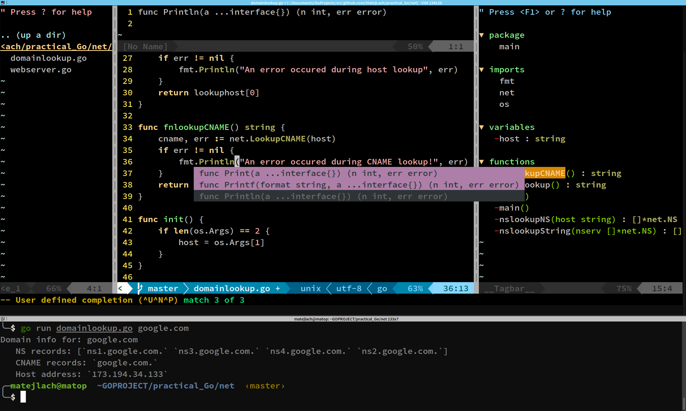

My Go-centric ViM setup
==

ViM as a Golang IDE.

--
This setup includes everything you'd expect for productive Go development; from project-aware autocompletion to integration of *go* tools, such as *gofmt* and *dodoc*. 
