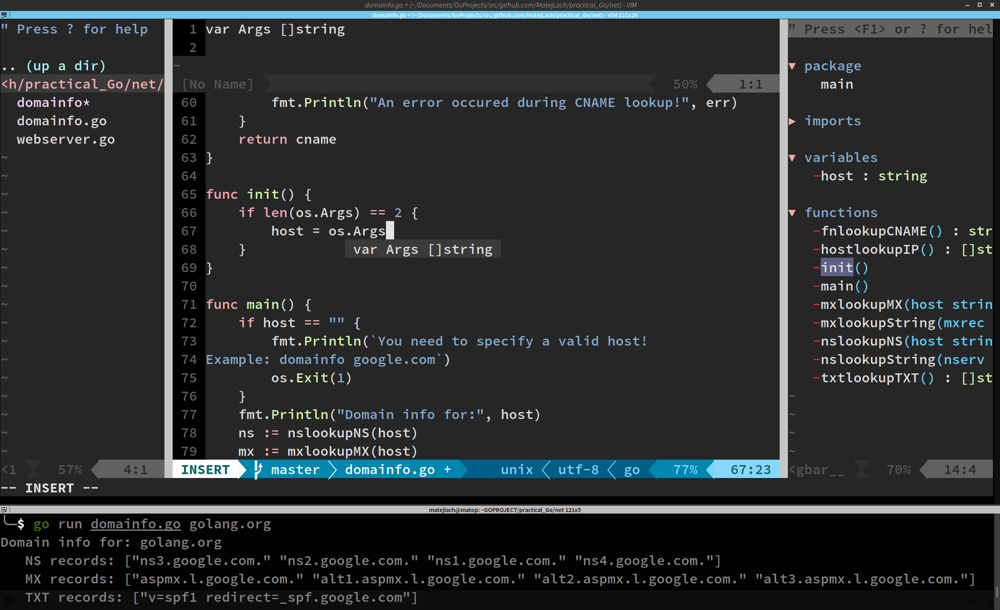

Golang-centric ViM development:
==

This setup includes everything you'd expect for productive Go development; from project-aware autocompletion to integration of *go* tools, such as *gofmt* and *dodoc*.

**Included plugins**:

- colorschemes
- delimitMate
- FuzzyFinder
- gist-vim
- gundo
- mru
- l9.vim
- lightline.vim
- nerdtree
- pathogen.vim
- syntastic
- tagbar
- GoldenView
- ultisnips
- vim-fugitive
- vim-go
- vim-snippets
- webapi-vim
- YouCompleteMe
- rust.vim
- racer.vim

P.S. The colourscheme is babymate256.

Enjoy!
